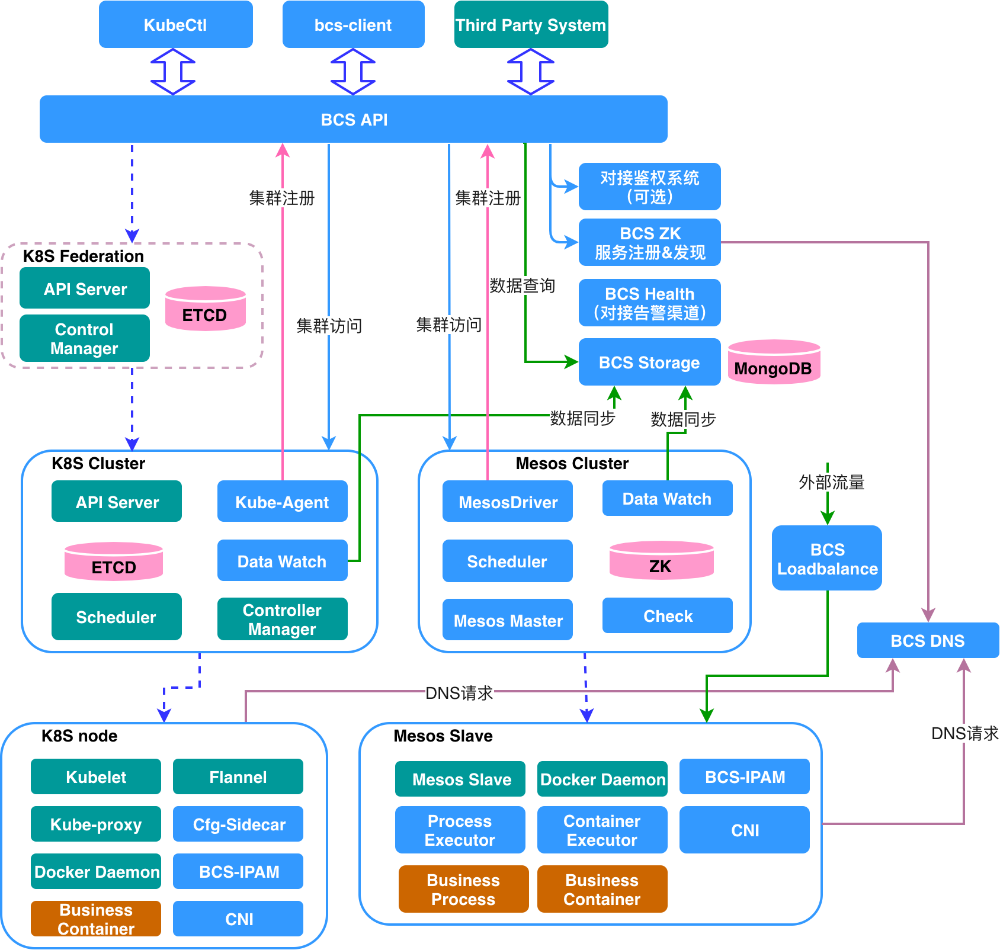

# 项目架构

BCS是统一的容器部署管理解决方案，为了适应不同业务场景的需要，BCS内部同时支持基于mesos和基于k8s的两种不同的实现。
下图为BCS以及Mesos集群的整体架构图：BCS client或者业务saas服务通过API接入，API根据访问的集群将请求路由到BCS下的mesos集群或者k8s集群。

下面是对Mesos编排的具体说明：
* Mesos自身包括Mesos Master和Mesos Slave两大部分，其中Master为中心管理节点，负责集群资源调度管理和任务管理；Slave运行在业务主机上，负责宿主机资源和任务管理。
* Mesos为二级调度机制，Mesos本身只负责资源的调度，业务服务的调度需要通过实现调度器（图中scheduler）来支持，同时需实现执行器executor（mesos自身也自带有executor）来负责容器或者进程的起停和状态检测上报等工作。
* Mesos（Master和Slave）将集群当前可以的资源以offer（包括可用CPU,MEMORY,DISK,端口以及定义的属性键值对）的方式上报给scheduler，scheduler根据当前部署任务来决定是否接受offer，如果接受offer，则下发指令给mesos，mesos调用executor来运行容器。
* Mesos集群数据存储在ZooKeeper，通过Datawatch负责将集群动态数据同步到BCS数据中心。
* Mesos driver负责集群接口转换。
* 所有中心服务多实例部署实现高可用：mesos driver为master-master运行模式，其他模块为master-slave运行模式。服务通过ZK实现状态同步和服务发现。

下面是对Kubenetes容器编排的说明：
* BCS支持原生Kubenetes的使用方式。
* Kubenetes集群运行的agent向BCS API服务进行集群注册。
* Kubenetes集群运行的data watch负责将该集群的数据同步到BCS storage。